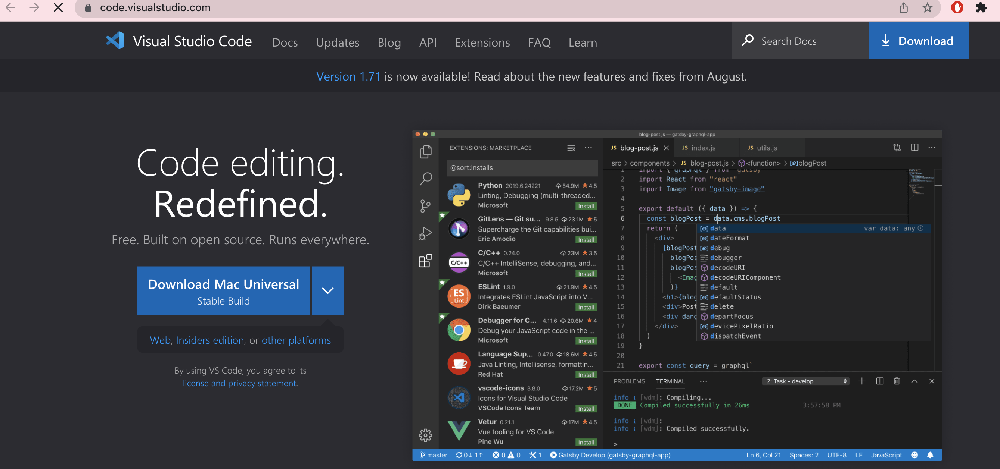
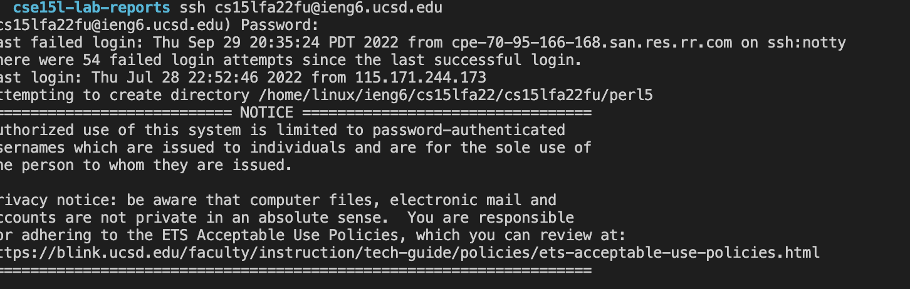
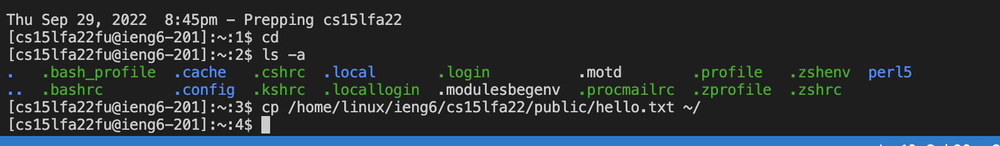
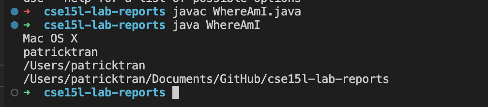
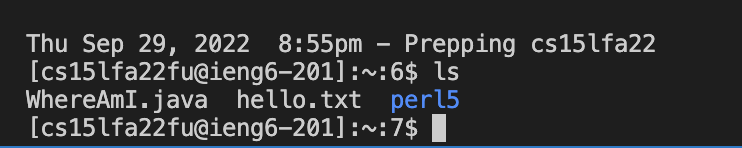
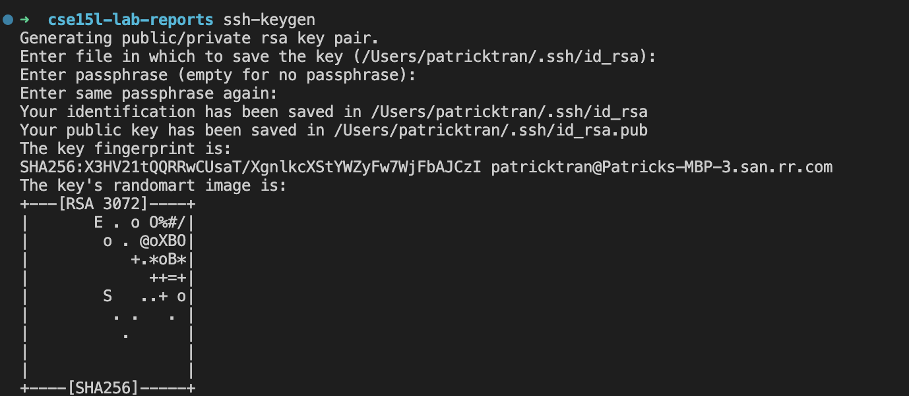
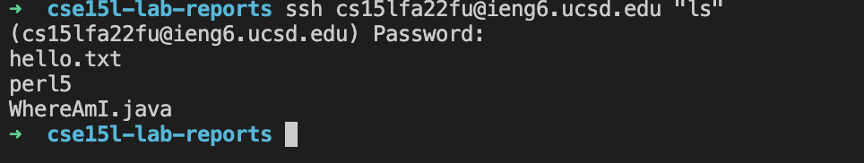

# Lab Report 2 Week 1

Summary: The lab report for this week was a little frustrating, because resetting my password took a long time, so I had to do most of the lab at home. So I would definitely recommend resetting your password before coming to the lab. Everything else seemed to be okay after this though.

## Step 1: Installing VS Code

Go on to the VS Code website and install it. The link can be found [here](https://code.visualstudio.com/).

## Step 2: Remotely Connecting

Once installed, open terminal and type the following command in: 

ssh cs15lfa22zz@ieng6.ucsd.edu
*Make sure to change the "zz" with the corresponding letters for your student account

Then type in your password
*Tutorial to reset your password [here](https://docs.google.com/document/d/1hs7CyQeh-MdUfM9uv99i8tqfneos6Y8bDU0uhn1wqho/edit).

## Step 3: Trying Some Commands

Then try some commands, like "cd" or "ls". Experiment with different ones and see what happens.

## Step 4: Moving Files with scp

First create a file called "WhereAmI.java"

Log back into ssh and use the command "ls". You should see the file in the directory now.

## Step 5: Setting an SSH Key

Then type in ssh-keygen in your terminal. This will allow you to ssh or scp without typing in your password.

## Step 6: Optimizing Reroute Running

This is the part of the lab where I did not finish, but here are some commands I used to find the most opitmal route.

