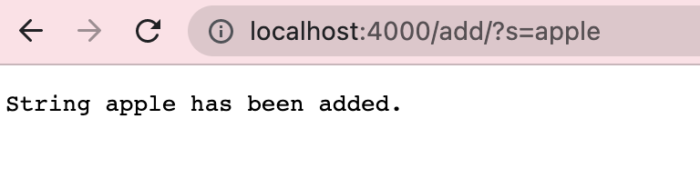
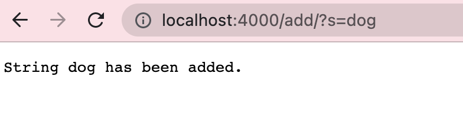
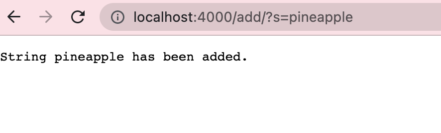
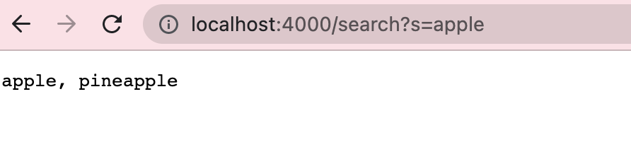
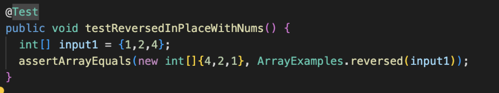
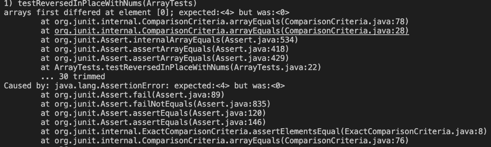
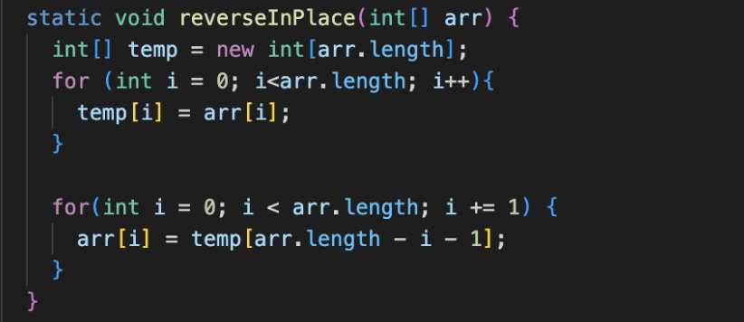
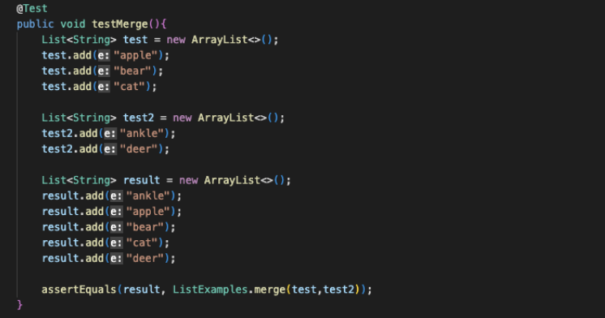
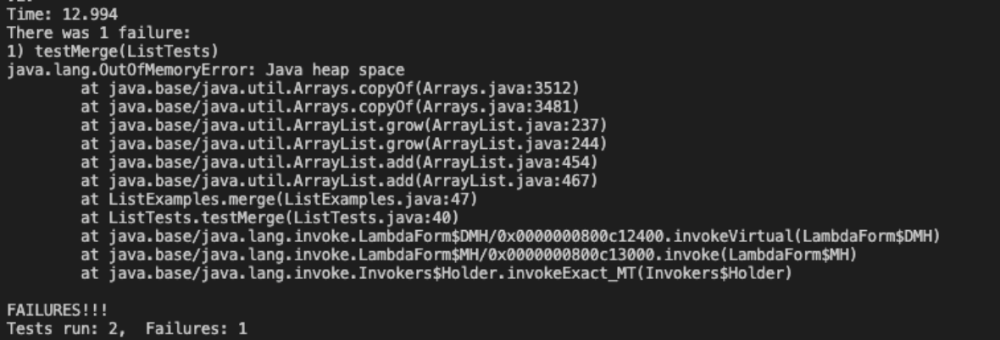
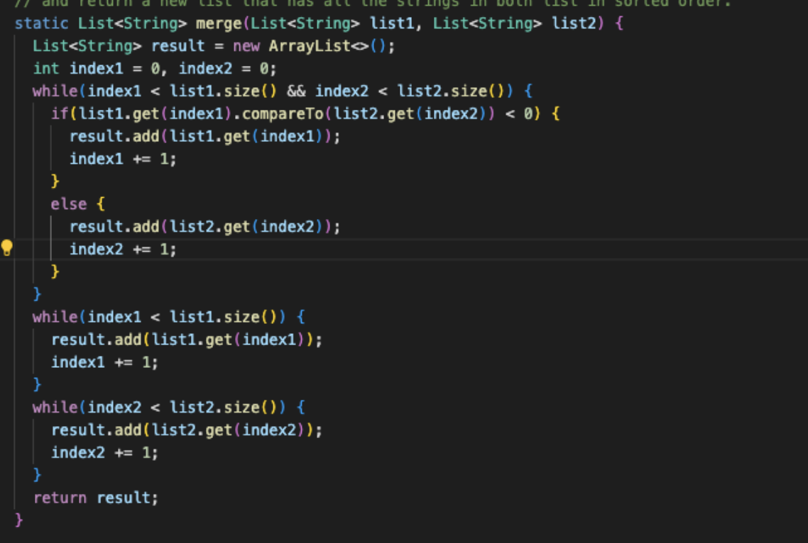

# Lab Report 3 Week 3

Summary: This lab was a lot harder than the previous labs. I felt like it had a lot more work compared than the others. I felt like I learned a lot though, specifically about writing texts, and I think this will help in CSE 12.

## Simplest Search Engine from Week 2

Here is my code I used for my search engine:

    import java.io.IOException;
    import java.net.URI;
    import java.util.ArrayList;

    class Handler implements URLHandler {
        // The one bit of state on the server: a number that will be manipulated by
        // various requests.

        ArrayList<String> a = new ArrayList<String>();

        public String handleRequest(URI url) {
            if (url.getPath().equals("/")) {
                return String.format("No String");
            } else if (url.getPath().contains("/add")){
                System.out.println("Path: " + url.getPath());
                if (url.getPath().contains("/add")) {
                    String[] parameters = url.getQuery().split("=");
                    if (parameters[0].equals("s")) {
                        a.add(parameters[1]);
                        return String.format("String " + parameters[1] + " has been added.");
                    }
                }
                return "404 Not Found!";
            } else {
                System.out.println("Path: " + url.getPath());
                if (url.getPath().contains("/search")) {
                    String[] parameters = url.getQuery().split("=");
                    ArrayList<String> subs = new ArrayList<String>();
                    if (parameters[0].equals("s")) {
                        for (int i = 0; i < a.size(); i++){
                            if ((a.get(i)).contains(parameters[1])){
                                subs.add(a.get(i));
                            }
                        }
                        String listString = String.join(", ", subs);
                        return listString;
                    }
                }
                return "404 Not Found!";
            }
        }
    }

    class SearchEngine {
        public static void main(String[] args) throws IOException {
            if(args.length == 0){
                System.out.println("Missing port number! Try any number between 1024 to 49151");
                return;
            }

            int port = Integer.parseInt(args[0]);

            Server.start(port, new Handler());
        }
    }

Here are the screenshots of it in action my local server:

In the first 3 screenshots, I am using the /add to add the words "apple", "dog", and "pineapple".

Here I am using:  
.contains("/add")  
.split("=")  
.equals("s")  
.add(parameters[1]), this value changes as it turns into apple

.contains("/add")  
.split("=")  
.equals("s")  
.add(parameters[1]), this value changes as it turns into dog

.contains("/add")  
.split("=")  
.equals("s")  
.add(parameters[1]), this value changes as it turns into pineapple

.contains("/search")
.split("=")
.equals("s")
.add(.a.get(i)), the value of the i changes as it goes through the for loop
  
  
    
## Two Different Bugs
Here are two bugs I found from my lab. The first one is wihtin the reverseInPlace method in ArrayList Examples. The second one is the merge method from LinkedListExamples.

-----

reverseInPlace failure-inducing input:  

reverseInPlace symptom:

reverseInPlace bug fix:

reverseInPlace explanation:  
In the symptom, it was expecting a 4 at element. What happened was that the array was actually never being updated with the correct numbers, so that is why there has to be another array there so that it takes the original numbers and puts it back in the original array with a for loop.  
  
--------------
  
merge failure-inducing input:  

merge symptom:

merge bug fix:

merge explanation:  
What happened in the symptom was that there was a Java heap space, indicating that this test went into an infinite loop. The bug explains this because in the original code, because index2 was not being updated in the bottom while loop. Instead index1 was updated, hence the loop.
