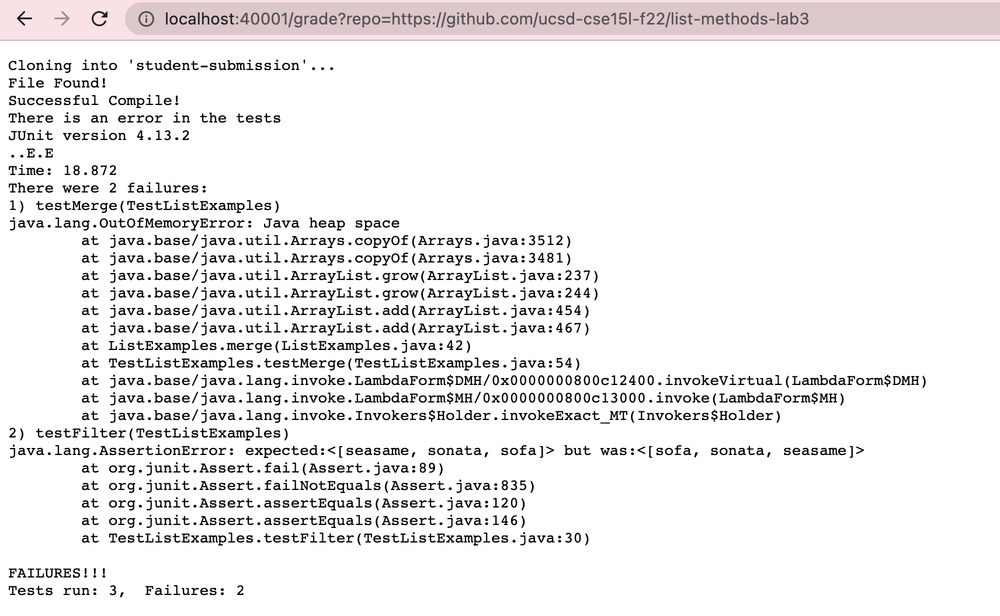
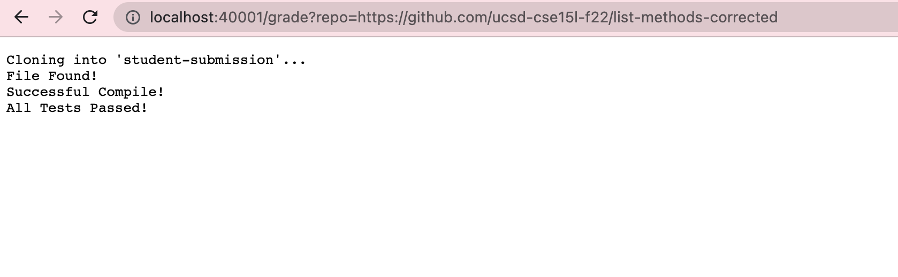
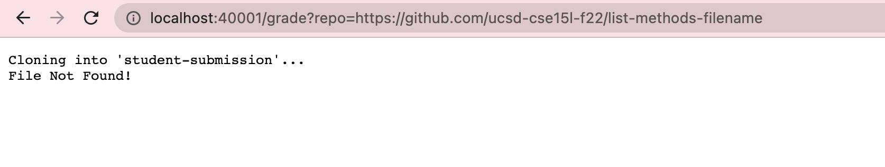

# Lab Report 6 Week 9

Summary: This lab report was harder than others, because I had trouble writing my grading script, and getting the right responses I wanted.

## My grade.sh
    set -e

    rm -rf student-submission
    mkdir student-submission
    git clone $1 student-submission

    cp TestListExamples.java student-submission
    cd student-submission

    CPATH=.:../lib/hamcrest-core-1.3.jar:../lib/junit-4.13.2.jar

    if [[ -f ListExamples.java ]];
    then 
        echo "File Found!"
    else
        echo "File Not Found!"
        exit 1
    fi

    set +e

    javac -cp $CPATH *.java

    if [[ $? -eq 0 ]]
    then
        echo "Successful Compile!"
    else
        echo "Compile Error!"
        exit 2
    fi

    java -cp $CPATH org.junit.runner.JUnitCore TestListExamples > results.txt 

    if [[ $? -eq 0 ]]
    then
        echo "All Tests Passed!"
        exit
    else
        FAILURE=$(grep "There " results.txt | grep -Eo "[1-3]")
        PASSED="$((3 - $FAILURE))"
        echo "There is an error in the tests"
        cat results.txt
        exit 3
    fi

Here are the results of the script being run on the GradeServer:

https://github.com/ucsd-cse15l-f22/list-methods-lab3
 

https://github.com/ucsd-cse15l-f22/list-methods-corrected

https://github.com/ucsd-cse15l-f22/list-methods-filename

## Tracing A Script

I will be tracing my script with my third screenshot, specifically using this repo: 
https://github.com/ucsd-cse15l-f22/list-methods-filename 

This repo is unique because it has wrong file names.

Below is a list of commands I used that have either a standard output or standard error.

1. line 19, which has an exit code of 1 which is a standard output
2. line 31, which has an exit code of 2 which is a standard error

The only if statement that ran was on line 14, which was the condition if the file was found. In that instance, the file was not found so it was valued as false, which produced the exit 1 code.

Lines 21 to 46 do not run, because of the early false on the if statement, which causes an early exit code.